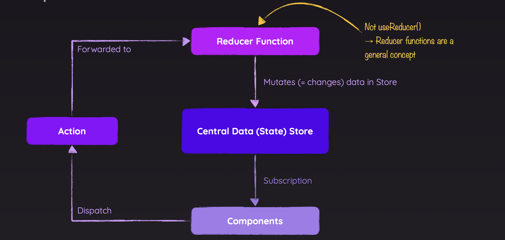

# React.js Note

***

## Intro

* This document is based on [Learn React by react.dev](https://react.dev/learn)
* React is  a JavaScript library for rendering UI
* React application begins at a "root" component `App.js`

***

## Components

* React is all about *Components*
* A component is a piece of the UI that has its own logic and appearance
* We don't have to manipulate DOM manually anymore with components
* **A component is just a JavaScript function**
  * Their names always begin with a capital letter
  * They return JSX markup
* React application begins at a "root" component

### JSX

* JavaScript XML
* A syntax extension for JavaScript that lets you write HTML-like markup inside a `.js` file
* Rules of JSX
  * Return a single root element
    * `React.createElement()` is invoked behind the scene
    * Built-in tag `<Fragment>`
      * Alternatively written as `<>...</>`
      * It's an empty tag
      * Let you group things without leaving any trace in the browser HTML tree
  * All tags must be closed
  * `camelCase `~~all~~ most of the things
    * HTML and SVG attributes are written in `camelCase`
    * For historical reasons, [`aria-*`](https://developer.mozilla.org/docs/Web/Accessibility/ARIA) and [`data-*`](https://developer.mozilla.org/docs/Learn/HTML/Howto/Use_data_attributes) attributes are written as in HTML with dashes
* Dynamic data: `{}`
  * **As text** directly inside a JSX tag
  * **As attributes** immediately following the `=` sign
  * Any JavaScript expression will work between curly braces, including function calls
* Fundamentally, JSX just provides a syntactic sugar for the `React.createElement` function


### `props` 

* `props` are the information that you pass to a JSX tag

* Process

  * Set `props`: Add **custom attributes** onto the custom HTML elements (components)
  * Merge into object: React merges all `props` into a single object
  * Receive `props`: Components (the function) will accept the `props` as the first argument

* Conventionally the parameter is named with `props`

* Usually you don't need the whole `props` object itself, so destruct it into individual `prop`

* Pass `props` through multiple components

  ```jsx
  function Profile(props) {
    return (
      <div className="card">
        <Avatar {...props} />
      </div>
    );
  }
  ```

  * De-constructing or setting default values on `props`: `...`

* Composition of components

  * When you nest component in another component, the parent component will receive that content in `props`

  * `{props.children}`

  * Like a wrapper

    ```jsx
    import Avatar from './Avatar.js';
    
    function Card({ children }) {
      return (
        <div className="card">
          {children}
        </div>
      );
    }
    
    export default function Profile() {
      return (
        <Card>
          <Avatar
            size={100}
            person={{ 
              name: 'Katsuko Saruhashi',
              imageId: 'YfeOqp2'
            }}
          />
        </Card>
      );
    }
    ```

* Pass a component identifier as a value for a `prop` to dynamically render different components inside a component

  * The `prop` should be named with a start of capital letter
  * The value: default element: string; customised element: `{ComponentName}`

* `props` are **immutable**

  * When a component needs to change its props (for example, in response to a user interaction or new data), it will have to “ask” its parent component to pass it *different `props`*— a new object

### Conditional Rendering

* Shortcuts: `<condition> ? <content1> : <content2>`, `<conidtion> && <content>`

### Rendering Lists

* `map`, `filter`: array of objects to array of JSX markup

* **`key`**

  * You need to give each array item a `key`
  * A string or a number that uniquely identifies it among other items in that array
  * Useful for future manipulations
  * Do **NOT** generate `key` on the fly, instead you should include them in your data
  * Where to get your `key`
    * Data from a database or API: use their keys
    * Locally generated data: use an incrementing counter [`crypto.randomUUID()`](https://developer.mozilla.org/en-US/docs/Web/API/Crypto/randomUUID) or a package like [`uuid`](https://www.npmjs.com/package/uuid) when creating items
  * The components won't receive `key` as a `prop`, it's only used as a hint by React itself
  
  ```jsx
  export default function List({ people }) {
    const listItems = people.map(person =>
      <li key={person.id}>{person.name}</li>
    );
    return <ul>{listItems}</ul>;
  }
  ```

### Keep Components **Pure**

* Components should only return their JSX, and not change any objects or variables that existed before rendering
  * It's totally okay to change variables and objects that you've just created while rendering inside the component functions

* React offers a "Strict mode" in which it calls each component's function twice during development
* By calling the component functions twice, strict mode helps find components that break these rules
* Strict mode has no effect in production
* [Side effects](#dealing-with-effects)
  * In React, **side effects usually belong inside event handlers**
  * Even though event handlers are defined *inside* your component, they don’t run *during* rendering! **So event handlers don’t need to be pure**
  * As a last resort, use `useEffect`


***

## Interactivity

### Responding to Events

* You can respond to events by declaring event handler functions **inside the components**

  ```jsx
  export default function Button() {
    function handleClick() {
      alert('You clicked me!');
    }
  
    return (
      <button onClick={handleClick}>
        Click me
      </button>
    );
  }
  
  // if the handler accept parameters, a common pattern for using it is:
  // <button onClick={() => handleClick(params)}>Click me</button>
  ```

* Often you'll want the parent component to specify a child's event handler and pass it to the child as a `prop`

* By convention, handlers should start with `handle`; handlers `prop` should start with `on`

* On all built-in HTML elements we have full access to all native DOM events

* Built-in components only support browser event names

* Custom components can have custom handler `prop` name

* Event handlers receive an **event object** as their only argument. By convention, it’s usually called `e`

* All events propagate in React except `onScroll`, which only works on the JSX tag you attach it to

  * Stop propagation: `e.stopPropagation()`

* `e.preventDefault()`

### `state`

* Why local variable isn't enough

  * **Local variables don’t persist between renders.** When React renders this component a second time, it renders it from scratch—it doesn’t consider any changes to the local variables
  * **Changes to local variables won’t trigger renders.** React doesn’t realize it needs to render the component again with the new data

* To update a component with new data, two things need to happen:

  * **Retain** the data between renders
  * **Trigger** React to render the component with new data (re-rendering)

* `state` is the component-specific memory

* `useState(initialState)`

  * A React Hook that lets you add a state variable to your component
  * `initialState`
    * The value you want the `state` to be initially
  * Returns
    * The current `state` variable to retain data between renders
    * The `set` function that lets you update the state to a different value and trigger a re-render
      * The `set` function **only updates the state variable for the next render**

  ```jsx
  import { useState } from "react";
  
  function Component(props) {
      const [title, setTitle] = useState(props.title);
  }
  ```

* You can have as many state variables of as many types as you like in one component

* `state` is isolated and private

  * If you render the same component multiple times, each will get its own state
  * State is fully private to the component declaring it, the parent component cannot change it

* **A `state` variable's value never changes within a render, even if its event handler's code is asynchronous**

* **`props` vs. `state`**

  * [**Props** are like arguments you pass](https://react.dev/learn/passing-props-to-a-component) to a function. They let a parent component pass data to a child component and customize its appearance. For example, a `Form` can pass a `color` `prop` to a `Button`
  * [**State** is like a component’s memory.](https://react.dev/learn/state-a-components-memory) It lets a component keep track of some information and change it in response to interactions. For example, a `Button` might keep track of `isHovered` state

### Render and Commit

* The process of requesting and serving UI
  1. Triggering a render
     * Component's initial render, or
     * The component's (or one of its ancestors) `state` has been updated
  2. Rendering the component (**Calling your component function**)
     * On initial render, React will call the root component `root.render()`
     * For **subsequent renders**, React will call the function component whose `state` update triggered the render (this process is recursive)
       * You may have thought about the performance issue, look at the [Performance section](https://legacy.reactjs.org/docs/optimizing-performance.html)
  3. Committing to the DOM
     * For the initial render, React will use `appendChild()` DOM API to put all the DOM nodes it has created on the screen
     * For re-renders, React will apply the **minimal **necessary operations to make the DOM match the latest rendering output
       * With the help of a virtual DOM
  4. Browser paint the screen
* Optimisation by avoiding unnecessary component function execution
  * `memo()`
    * Wrap the component function as a parameter of `memo()`
    * Component function won't execute if the `props` value are the same
    * Blocking a component execution will also block all children components execution
    * However,
      * Don't overuse `memo()`
      * Use it as high up in the component tree as possible
      * Checking `props` with `memo()` costs performance
      * Don't use it on components where `props` change frequently

  * Refactor your project to a clever structure

### Queueing a series of `state` updates

* Batching

  * React waits until all code in the event handlers has run before processing your state updates

* Update `state` **based on its previous value**

  * Pass **a function** to `setSomething` as `nextState`, which will be treated as an **updater function**

  * [Reference](https://react.dev/reference/react/useState#setstate)

  * **Updater functions must be pure** and only *return* the result

  * **React queues this function to be processed after all the other code in the event handler has run**

  * During the next render, React goes through the queue and gives you **the latest updated `state`**

  * By convention, name the updater function argument by the first letters of the corresponding `state` variable

    ```jsx
    import { useState } from 'react';
    
    export default function Counter() {
      const [number, setNumber] = useState(0);
    
      return (
        <>
          <h1>{number}</h1>
          <button onClick={() => {
            setNumber(n => n + 1);
            setNumber(n => n + 1);
            setNumber(n => n + 1);
          }}>+3</button>
        </>
      )
    }
    ```

* Update the DOM synchronously

  ```react
  flushSync(() => {
    setTodos([ ...todos, newTodo]);
  });
  listRef.current.lastChild.scrollIntoView();
  ```

  * This will instruct React to update the DOM synchronously right after the code wrapped in `flushSync` executes


### Updating Objects or Arrays in `state`

* You shouldn't change objects or arrays that you hold in the `state` directly
* Instead, when you want to update it, you need to create a new one (or make a copy of an existing one), and then set the `state` to use the copy
* **Treat `state` as read-only**
* Updating a nested object or array of objects: [Immer](https://github.com/immerjs/use-immer)
  * To achieve deep clone
  * How to use Immer
    * Run `npm install use-immer` to add Immer as a dependency
    * Then replace `import { useState } from 'react'` with `import { useImmer } from 'use-immer'`

### Component Lifecycle

- A component *mounts* when it’s added to the screen
- A component *updates* when it receives new `props` or `state`, usually in response to an interaction
- A component *unmounts* when it’s removed from the screen
- All values declare in the component body are reactive


***

## Managing `state`

### Thinking about UI declaratively

* Identify component's different visual states

  * Treat component as a ***state machine***
  * Have a `state` variable - `status`, and let it decide how the component should look like (return different markup)

* Determine the human or computer events that trigger those state changes

  * Set `state` variables to update UI

* Represent the `state` in memory with `useState`

* Remove any non-essential `state`

* Connect the event handlers to `setState`

  >  Components wrap controller and view together, but make them much easier to code and much less fragile

### Principle for structuring `state`

* Group related state
* Avoid contradiction
* Avoid redundance
* Avoid duplication
* Avoid deeply nested `state`

### Sharing  `state` between components

* **Lifting `state` up**
  * Sometimes, you want the `state` of two components to always change together. To do it, remove `state` from both of them, move it to their closest common parent, and then pass `state` and `setState` down to them **via `props`**
* Uncontrolled components: components with local `state`
* Controlled component: the important information in it is driven by `props` rather than its own local `state`
* **When writing a component, consider which information in it should be controlled (*via `props`*), and which information should be uncontrolled (*via `state`*)**
* **Single source of truth**

### React maintain an UI tree (like DOM)

* `state` is tied to a **position** and **component type** in the tree
  * **`state` is held inside React instead of "living" inside the component**
  * React preserves a component’s `state` for as long as it’s being rendered at its position in the UI tree. If it gets removed, or a different component gets rendered at the same position, React discards its `state`
  * **It's the position in the UI tree - not in the JSX markup**
    * Same components at the same position preserves `state`
    * Different components at the same position reset `state`
* `key` can be used to make React distinguish between any components
  * `key` isn't just for lists
  * `key` is not globally unique, they only specify the position within the parent
  * Use `key` for **resetting components at the same position**
  
    * React will destroy the old component instance if the value of `key` has changed
    * Unmount and remount the component

### Context API

* Prop drilling: passing shared data through multiple components layers

* It can be a problem when you have too many `state` to manage

* Solution 1: Component Composition

* **Context**

  * Lets the parent component make some information available to any component in the tree below it—no matter how deep—without passing it explicitly through props

  * **How to use `Context`**

    1. Create the context

       * Create a context in a new file and export it

         ```react
         // LevelContext.js
         import { createContext } from 'react';
         
         export const LevelContext = createContext(1);
         ```

       * The only argument to `createContext` is the *default* value

    2. Provide the context

       * If you don’t provide the context, React will use the default value

       * Wrap the component who provide context with a context provider

         ```react
         // Section.js
         import { LevelContext } from './LevelContext.js';
         
         export default function Section({ level, children }) {
           return (
             <section className="section">
               <LevelContext.Provider value={level}>
               {/* This tells React:
               		If any component inside <Section> ask for `LevelContext,
               		give them this `level`.
               		The component will use the value of the nearest
               		<LevelContext.Provider> in the UI tree above it
               */}
                 {children}
               </LevelContext.Provider>
             </section>
           );
         }
         ```

       * **Outsourcing `context` and `state` into a separate Provider component is also a common pattern**

    3. Consume the context

       ```react
       // Heading.js
       import { useContext } from 'react';
       import { LevelContext } from './LevelContext.js';
       
       export default function Heading({ children }) {
         const level = useContext(LevelContext);
         // `useContext` tells React that the `Heading`component wants to 
         // read the `LevelContext`
         
         // ...
       }
       
       // App.js
       <Section level={4}>
         <Heading>Sub-sub-heading</Heading>
         <Heading>Sub-sub-heading</Heading>
         <Heading>Sub-sub-heading</Heading>
       </Section>
       ```

       * React will re-execute the component function if the context value changes

       * You can also outsource `useContext(LevelContext)` into the Provider component

         ```react
         // LevelContext.js
         export function useLevel() {
           return useContext(LevelContext);
         }
         
         // Heading.js
         import { useLevel } from "./LevelContext.js";
         const level = useContext();
         ```

         * Export custom Hooks

  * **Context lets you write components that “adapt to their surroundings” and display themselves differently depending on *where* (or, in other words, *in which context*) they are being rendered**

  * In React, the only way to override some context coming from above is to wrap children into a context provider with a different value

  * Different React contexts don't override each other

  * One component may use or provide many different contexts without a problem

  * **Use case for context**

    * **Theming:** If your app lets the user change its appearance (e.g. dark mode), you can put a context provider at the top of your app, and use that context in components that need to adjust their visual look
    * **Current account:** Many components might need to know the currently logged in user. Putting it in context makes it convenient to read it anywhere in the tree. Some apps also let you operate multiple accounts at the same time (e.g. to leave a comment as a different user). In those cases, it can be convenient to wrap a part of the UI into a nested provider with a different current account value
    * **Routing:** Most routing solutions use context internally to hold the current route. This is how every link “knows” whether it’s active or not. If you build your own router, you might want to do it too
    * **Managing state:** As your app grows, you might end up with a lot of state closer to the top of your app. Many distant components below may want to change it. It is common to [use a reducer together with context](https://react.dev/learn/scaling-up-with-reducer-and-context) to manage complex state and pass it down to distant components without too much hassle

### Reducer

* A reducer in React or JavaScript programming is a function that reduce one or more complex values to a simpler one

* You can consolidate state update logic with a reducer outside your component in a single function, called `reducer`

* How to use Reducer

  1. Move from setting state to dispatch actions

     ```react
     // From this
     function handleAddTask(text) {
       setTasks([
         ...tasks,
         {
           id: nextId++,
           text: text,
           done: false,
         },
       ]);
     }
     
     function handleChangeTask(task) {
       setTasks(
         tasks.map((t) => {
           if (t.id === task.id) {
             return task;
           } else {
             return t;
           }
         })
       );
     }
     
     function handleDeleteTask(taskId) {
       setTasks(tasks.filter((t) => t.id !== taskId));
     }
     
     // To this
     function handleAddTask(text) {
       dispatch(
         // "action" object
         {
           type: 'ADD',
           payload: {
             id: nextId++,
           	text: text,
           }
       	}
       );
     }
     
     function handleChangeTask(task) {
       dispatch({
         type: 'CHANGE',
         payload: task,
       });
     }
     
     function handleDeleteTask(taskId) {
       dispatch({
         type: 'DELETE',
         payload: taskId,
       });
     }
     ```

     * An action object can have any shapes, by convention it's common to give a string `type` that describes what happened, and pass any additional information in an object `payload`

  2. Write a reducer function

     1. Declare the current `state` as the first argument
     2. Declare the `action` object as the second argument
     3. Return the next `state` from the reducer

     ```react
     function yourReducer(state, action) {
       // return next state for React to set
     }
     ```

     ```react
     function tasksReducer(tasks, action) {
       switch (action.type) {
         case 'ADD': {
           return [
             ...tasks,
             {
               id: action.payload.id,
               text: action.payload.text,
               done: false,
             },
           ];
         }
         case 'CHANGE': {
           return tasks.map((t) => {
             if (t.id === action.payload.id) {
               return action.payload;
             } else {
               return t;
             }
           });
         }
         case 'DELETE': {
           return tasks.filter((t) => t.id !== action.payload);
         }
         default: {
           throw Error('Unknown action: ' + action.type);
         }
       }
     }
     ```

     * It is recommend wrapping each `case` block into the `{` and `}` curly braces so that variables declared inside of different `case`s don’t clash with each other
     * Reducer function is declared **outside the component function** so that it won't be re-created every time the component gets updated

  3. Use the reducer from your component

     ```react
     import {useReducer} from 'react';
     
     // From this
     const [tasks, setTasks] = useState(initialTasks);
     
     // To this 
     const [tasks, dispatch] = useReducer(tasksReducer, initialTasks);
     ```

     * The `useReducer` Hook takes two arguments:
       1. A reducer function
       2. An initial state
     * And it returns:
       1. A stateful value
       2. A dispatch function (to “dispatch” user actions to the reducer)
     * If you want, you can even move the reducer to a different file

* **Reducer must be pure**

* Each action describes a single user interaction, even if that leads to multiple changes in the data

* Writing concise reducer with `immer`

  * `useImmerReducer`
  * Reducers managed by `useImmerReducer` can mutate their first argument `draft` and don’t need to return state (**remember to `break`**)

***

## `refs`

### What is `refs`

* When you want a component to store some information, but you don't want to that information to trigger new renders, you can use a `ref`

* Adding a `ref` to your component

  ```react
  import { useRef } from 'react';
  
  const ref = useRef(0);
  // useRef returns an object like this:
  // { current: 0 }
  ```

* You can mutate `ref` instead of using a set function, just change the value of `ref.current`

* **`ref` is mutable; `state` is immutable**

* When to use `refs`

  * Storing `timeout` IDs
  * Storing and manipulating DOM elements
  * Storing other objects that aren't necessary to calculate the JSX

* **Usually, you will access `refs` from event handlers**

### Manipulating DOM with `refs`

* DOM manipulation is the most common use case for `refs`

* Getting a `ref` to the node

  ```react
  const myRef = useRef(null);
  
  <div ref={myRef}></div>
  
  myRef.current.scrollIntoView();
  ```

* **Accessing another component's DOM nodes**

  * By default. React does not let a component access the DOM nodes of other components

  * A component can specify that it "forwards" its `ref` to one of **its children**

    ```react
    const MyInput = forwardRef((props, ref) => {
      return <input {...props} ref={ref} />;
    });
    ```

    * `<MyInput ref={inputRef} />` tells React to put the corresponding DOM node into `inputRef.current`. However, it’s up to the `MyInput` component to opt into that—by default, it doesn’t
    * The `MyInput` component is declared using `forwardRef`. **This opts it into receiving the `inputRef` from above as the second `ref` argument** which is declared after `props`
    * `MyInput` itself passes the `ref` it received to the `<input>` inside of it

  * In design systems, it is a common pattern for low-level components like buttons, inputs, and so on, to forward their refs to their DOM nodes

* You can expose component APIs via `useImperativeHandle` hook

* Avoid changing DOM nodes managed by React

***

## Dealing with `Effects`

### What is `Effects`

* Two types of logic inside React components
  * **Rendering code**
    * Where you take the `props` and `state`, transform them, and return the JSX you want to see on the screen
    * Renderer must be pure
  * **Event handlers**
    * Nested functions inside your components that do things rather than just calculate them
    * Event handlers contain [“side effects”](https://en.wikipedia.org/wiki/Side_effect_(computer_science)) (they change the program’s state) caused by a specific user action
  * Sometimes it isn't enough
  
* `effects` let you specify side effects are **caused by rendering itself, or father components' `state` change (*which is, essentially, re-rendering itself*), rather than by a particular event**

  > *For example, a `state` change in the event handler of a component can cause some side effects that need to be handled in the `useEffect` inside the child component*
  >
  > Logic inside event handlers is **not reactive**
  >
  > Logic inside Effects is **reactive**

* `effects` run **at the end of a [commit](#render-and-commit) after the screen updates**. This is a good time to synchronize the React components with some **external system** (like network or a third-party library or browser APIs)

### `effects` & `dependencies`

* How to write an `effect`

  1. Declare an `effect`

     * By default, your `effect` will run every render

     ```react
     useEffect(() => {
       // Code here will run
     });
     ```

  2. Specify the `dependencies`

     * Most `effects` should only re-run when needed rather than after every render
     * You can tell React to skip unnecessary re-running the `effect` by specifying an **array** of `dependencies` as the second argument to the `useEffect` call
     * The dependency array can contain multiple dependencies. **React will only skip re-running the `effect` if *all* of the dependencies you specify have exactly the same values as they had during the previous render**
     * You can't "choose" your dependencies

     ```react
     useEffect(() => {
       // This runs after every render
     });
     
     useEffect(() => {
       // This runs only on mount (when the component appears)
     }, []);
     
     useEffect(() => {
       // This runs on mount and also if either a or b have changed since the last render
     }, [a, b]);
     ```

     *  React compares the dependency values using the [`Object.is`](https://developer.mozilla.org/en-US/docs/Web/JavaScript/Reference/Global_Objects/Object/is) comparison
       * The problem with object or function dependencies: infinite loop
         * `effect` execute even if the dependencies are logically equivalent (*with different pointers*)
         * **`useCallback`** to solve this problem
           * Wrap the function dependencies in the `useCallback()`
         * Or, try to avoid them
     *  Mutable values (including global variables) aren’t reactive, so they shouldn't be dependencies
        *  A mutable value like `location.pathname` can’t be a dependency
        *  A mutable value like `ref.current` or things you read from it also can’t be a dependency
        *  `ref` can be listed in dependencies but no point to do it because it's never changed

  3. Add cleanup if needed

     * Some `effects` need to specify how to stop, undo, or clean up whatever they were doing
     * Return a cleanup function from your `effect`
     * React will call your cleanup function **each time before the `effect` runs again**, and one final time when **the component unmounts (gets removed)**

     ```react
       useEffect(() => {
         const connection = createConnection();
         connection.connect();
         return () => {
           connection.disconnect();
         };
       }, []);
     ```

* A potential problem with `effects` and `setState`: an infinte loop

  * `effect` execute after rendering, `setState` inside `effect` re-trigger the rendering
  * Solution: remove `state` from dependencies and pass updater function to `setState` in `useEffect()`
  
* How to handle React remount the component twice in development

  * Controlling non-React widgets
  * Subscribing to events
  * Triggering animations
  * Fetching data
  * Sending analytics

* Additionally, React will remount the `effects` whenever you save a file in development

### When NOT to use `useEffect()`

* Some logic should only run once when the application starts. You can put it outside your components
  * **Those codes wil execute once the first time the file is imported**
* Updating state based on `props` and `state`
  * Calculate the value inside the component
* 

***

## React Hooks

* **Hooks are functions that let you "hook into" React state and lifecycle features from function components**
* Functions starting with `use`
* Can only be called at the top level of your components or your own Hooks
* Can only call Hooks on the top level

### [`useCallback()`](https://react.dev/reference/react/useCallback)

* Let you cache a function definition between re-renders

  ```react
  const cachedFn = useCallback(fn, dependencies);
  ```

* Return

  * On the initial render, `useCallback` returns the `fn` function you have passed
  * During subsequent renders, it will either return an already stored `fn`  function from the last render (if the dependencies haven’t changed), or return the `fn` function you have passed during this render

* Usage

  * You pass it as a prop to a component wrapped in `memo()`. You want to skip re-rendering if the value hasn’t changed. Memoization lets your component re-render only if dependencies changed
  * The function you’re passing is later used as a dependency of some Hook. For example, another function wrapped in `useCallback()` depends on it, or you depend on this function from `useEffect()`

### [`useMemo()`](https://react.dev/reference/react/useMemo)

* Let you cache the result of a calculation between re-renders

  ```react
  const cachedValue = useMemo(calcValue, dependencies);
  ```

* Parameters

  * `calculateValue`: **The function calculating the value** that you want to cache. It should be pure, should take no arguments, and should return a value of any type. React will call your function during the initial render. On next renders, React will return the same value again if the `dependencies` have not changed since the last render. Otherwise, it will call `calculateValue`, return its result, and store it so it can be reused later

* Return

  * On the initial render, `useMemo` returns the result of calling `calculateValue` with no arguments 
  * During next renders, it will either return an already stored value from the last render (if the dependencies haven’t changed), or call `calculateValue` again, and return the result that `calculateValue` has returned

* Usage

  * **You should only rely on `useMemo()` as a performance optimization**
  * Skipping expensive recalculations

### Custom Hooks

* Share logic between components
* Hook names always start with `use`
* Custom hooks let you share stateful logic, not `state` itself; each call to a Hook is completely independent from every other call to the same Hook
* When to use custom hook
  * With time, most of your app's `effect` will be in custom Hooks
    * You make the data flow to and from your Effects very explicit
    * You let your components focus on the intent rather than on the exact implementation of your Effects
    * When React adds new features, you can remove those Effects without changing any of your components

  * Keep custom Hooks focused on concrete high-level use cases
  * A good custom Hook makes the calling code more declarative by constraining what it does


***

## Styling React Components

### Styling with vanilla CSS

* Import CSS file into corresponding JSX file
* Pros
  * CSS code is decoupled from JSX code
* Cons
  * You need to know CSS
  * **CSS is not scoped to components**, CSS rules may clash across components

### Scoping Styles

* Use inline `style` attribute 
  * The value is an object, not a string
* Use CSS modules
  * Change `Component.css` to `Component.module.css`
  * Change `import "./Component.css"` to `import classes from "./Component.module.css"`
  * `<p className={classes.paragraph}>test</p>`
* CSS-IN-JS Styling with "Styled Components"
  * Use a package [Styled components](https://styled-components.com/) 


### Styling with Tailwind CSS

* The main idea of Tailwind: add tiny utility CSS classes to HTML elements
* [Tailwind website](https://tailwindcss.com/)

### Dynamic Styling

* Dynamic inline styling
* Dynamic styling by add class name to component dynamically, using template literal

***

## Debugging React Apps

* Error messages
* Browser debugger
* "strict mode"
  * A React component `StrictMode` as an wrapper for other components
* React DevTools

***

## Class-Based Components

### What & Why

* Functional component is the default and most modern approach
* Traditionally, which means before React 16.8, you had to use class-based components to manage `state` 
* React 16.8 introduced *React Hooks* for functional components
* Class-based components **CAN'T** use React Hooks

### Working with Class-Based Components

```react
import { Component } from 'react';

class User extends Component {
  static contextType = UsersContext;
  // pitfall: can only link to one context
  
  constructor() {
    super();
    // For class-based component, state is always an object
    // And it also has to be a property named "state"
    this.state = {
      showUsers: true,
      more: "test",
    };
  }
  
  toggleUsersHandler() {
    // React will merge the new state object with the old one
    // this.setState({showUsers: false});
    this.setStae((curState) => {return {showUsers: !curState.showUsers};});
  }
  
  render() {
    const usersList = (
      <ul>
      	{this.context.users.map(user => <User key={user.id} name={user.name} />)}
      </ul>
    );
    
    return (
      <div className={classes.user}>
        <button onClick={this.toggleUsersHandler.bind(this)}>
        	{this.state.showUsers ? "Hide" : "Show"} Users
        </button>
        {this.state.showUsers && usersList}
      </div>
  	);
  }
}

// Component lifecycle methods
// A more imperative way, you have to add if block to specify when you want to skip the execution
componentDidMount() === useEffect(fn, []);							// Called once a component mounted
componentDidUpdate() === useEffect(fn, [someValue]);		// Called once a component updated
componentWillUnmount() === //cleanup function						// Called once a component unmounted
```

### Error Boundaries

* Right now (Nov 17 2023) this feature can only be used in class-based component

* An error generated inside a component cannot be handled inside it, it should be treated as an information, and be catched and handled in the parent component

* ```react
  import { Component } from 'react';
  
  // Wrap this error handler component around components should be protected by it
  export default class ErrorBoundary extends Component {
    constructor() {
      super();
      this.state = {hasError: false};
    }
    
    componentDidCatch(error) {
      this.setState({hasError: true});
    }
    
    render() {
      if(hasError)
        return <p>Something went wrong!</p>;
      
      return this.props.children
    }
  }
  ```

***

## Handling HTTP Request

### How to Connect a Back-end / Database

* Not all operations can be performed in the browser
  * Cannot connect to a database directly
  * Cannot access a file system
  * Etc.
* Browser <-> Back Server <-> Database via HTTP

### Fetching Data

* `useEffect()` + `fetch()`
* Handle loading status
* Handle HTTP errors
* Outsource `AJAX(url, config, initialData)` helper function

```react
useEffect(() => {
  (async function () {
    setIsFetching(true);
    try {
      const response = await fetch("http://localhost:3000/places");
    	if(!response.ok) {
      	throw new Error(`💥 Failed to fetch data! ${response.status}`);
    	}
      const data = await response.json();
      setPlaces(data.places);
    } catch(err) {
      setError(true);
      console.error(error.message);
    }
    setIsFetching(false);
  })();
}, []);
```

### Sending Data

```react
export async function updateUserPlaces(places) {
  const response = await fetch("http://localhost:3000/user-places", {
    method: "PUT",
    body: JSON.stringify({ places }),
    headers: {
      "Content-Type": "application/json"
    }
  });
  const data = await response.json();
  
  if(!response.ok)	throw new Error("Failed to update user data!");
  
  return data.message;
}
```

* Handler functions can be `async`
* Optimistic updating
  * Change the UI immediately before sending data behind the screen
  * Rollback the change if HTTP request fail

***

## Working with Forms & User Input

### What is Form

* [HTML Forms](https://www.w3schools.com/html/html_forms.asp)
* The `for` attribute of the `<label>` tag should be equal to the `id` attribute of the `<input>` element to bind them together
  * In JSX it's named `htmlFor`
* Each input field must have a `name` attribute to be submitted. If the `name` attribute is omitted, the value of the input field will not be sent at all
* Validating user input is the trickier part

### Handling Form Submission

* Form submission

  * By default, the browser sends a HTTP request to the server when a button inside `form` has been clicked; therefore, the page will reload
  * This can be a problem when there is no handler for this request on the server (React app)
  * Solution
    * `<button type="button"></button>`
    * Refactor from `<button onClick={handler}></button>` to `<form onSubmit={handler}></form>` + `e.preventDefault()`
      * Suggested way

* Getting user input via `state`

  * Two-way binding for updating inputs: `onChange={handler}` + `setState(e.targer.value)`
  * Make it generic by creating object `state` and refactoring to one handler `handlerInputChange(identifier, e)`

* Getting user input via `ref`

  * Link `refs` to `input` elements
  * Have to use `ref` to manipulate DOM directly which is not recommended
  * Cannot bundle `refs` into one object

* Getting user input via `FormData` & native Browser APIs

  * Useful for handling form that has lots of inputs
  * Example

  ```react
  function handleSubmit(e) {
    e.preventDefault();
    
    const fd = new FormData(e.target);
    const acquisition = fd.getAll("acquisition");			// get all values asscoiated with a given input name
    const data = Object.fromEntries(fd.entries());
    data.acquisition = acquisition;
  }
  ```

* Resetting Form

  * `<button type="reset">Reset</button>`; or,
  * Reset `state`; or,
  * `ref.current.value = ""`; or,
  * `e.target.reset()`
    * `e.target` is the form element

### Validating User Input

* Compute the `isValid` logic and render conditionally
* Always add `onSubmit` validation
* Validating input on every key stoke via `state`
  * Errors may be shown too early
* Validating input upon lost focus
  * `OnBlue={handleInputBlur}`
  * Errors may not disappear when the user starts to type again

> Combining validating on key stoke and lost focus is a good pattern

* Validating input upon form submission
* Validating input via built-in validation `props`
  * `type`, `required`, etc.

> Combining custom and built-in validation logic is also a good pattern

### Building Custom Solutions

* Custom `Input` Component
* Custom `useInput` Hook
* Outsource validation logic
* Use third-party form libraries

***

## Redux

### What is Redux

* Redux is a state management system for *cross-component* or *app-wide* state

* Redux can be used anywhere without React

* Core concept of Redux

  

* Redux Toolkit

  * [**Redux Toolkit**](https://redux-toolkit.js.org/) (also known as **"RTK"** for short) is our official recommended approach for writing Redux logic

  * The `@reduxjs/toolkit` package wraps around the core `redux` package, and contains API methods and common dependencies that are essential for building a Redux app

  * **If you are writing any Redux logic today, you should be using Redux Toolkit to write that code!**

### Why using Redux

* Potential problems of `context`
  * Deeply nested components
  * Complex providers
  * Performance issue from high-frequency changes
* **Redux is most useful in cases when**:
  - You have large amounts of application state that are needed in many places in the app
  - The app state is updated frequently
  - The logic to update that state may be complex
  - The app has a medium or large-sized codebase, and might be worked on by many people
  - You need to see how that state is being updated over time
* [When(and when not) to reach for Redux by Mark Erikson](https://changelog.com/posts/when-and-when-not-to-reach-for-redux)
* In a nutshell, use the tool when you need it

### How to use Redux

#### Redux Core

* **Store**

  * The current Redux application state lives in an object called **store**

    ```javascript
    const redux = require("redux");
    const store = redux.createStore(counterReducer)
    
    console.log(store.getState())
    // {value: 0}
    ```

* **Subscriber**

  ```react
  const state = store.getState();
  store.subscribe(render);
  ```

* **Selector**

  ```react
  const selectCounterValue = state => state.value
  const currentValue = selectCounterValue(store.getState())
  ```

* **Dispatch**

  * The Redux `store` has a method called `dispatch`

  * **The only way to update the `state` is to call store.dispatch(action)**

  * The `store` will run its `slice reducer` function and save the new `state` value inside

    ```react
    store.dispatch({ type: 'counter/increment' })
    ```

  * Typically we call `actionCreator` to dispatch the right `action`

    ```react
    const increment = () => {
      return {
        type: 'counter/increment'
      }
    }
    
    store.dispatch(increment())
    
    console.log(store.getState())
    // {value: 1}
    ```

* **Reducer**

  * Reducer is a function that receives the current `state` and an `action` object, decide how to update the `state` id necessary, and return the new `state`

  * **You can think of a `reducer` as an event listener which handles events based on the received action (event) type**

  * Reducer should be a pure function

    * They must not do any asynchronous logic, calculate random values, or cause other "side effects"

  * State should be immutable

    ```react
    const initialState = { value: 0 }
    
    function counterReducer(state = initialState, action) {
      // Check to see if the reducer cares about this action
      if (action.type === 'counter/increment') {
        // If so, make a copy of `state`
        return {
          ...state,
          // and update the copy with the new value
          value: state.value + 1
        }
      }
      // otherwise return the existing state unchanged
      return state
    }
    ```

* **Action**

  * An `action` is a plain JavaScript object that has a `type` field

  * **You can think of an action as an event that describes something that happened in the application**

  * The `type` field should be a string that gives this action a descriptive name. We usually write that type string like `"domain/eventName"`, where the first part is the feature or category that this action belongs to, and the second part is the specific thing that happened

  * An action object can have other fields with additional information about what happened. By convention, we put that information in a field called `payload`

    ```react
    const addTodoAction = {
      type: 'todos/todoAdded',
      payload: 'Buy milk'
    }
    ```

* **Action Creators**

  * An action creator is a function that creates and return `action` object

  * It is typically used so we don't have to write the `action` object by hand everytime

    ```react
    const addTodo = text => {
      return {
        type: 'todos/todoAdded',
        payload: text
      }
    }
    ```

#### **React-Redux Application Contents (Modern way)**

* Redux allows `store` setup to be customised with different plugins (`middleware` and `enhancers`)

```react
// store.js
import { configureStore } from '@reduxjs/toolkit'
import counterReducer from '../features/counter/counterSlice'

export default configureStore({
  // root reducer
  reducer: {
    // slice reducer
    counter: counterReducer
  }
})
// When we pass in an object like {counter: counterReducer}, that says that 
// we want to have a state.counter section of our Redux state object, and that 
// we want the counterReducer function to be in charge of deciding if and 
// how to update the state.counter section whenever an action is dispatched.
```

* **A "redux slice" is a collection of Redux reducer logic and actions for a single feature in your app**, typically defined together in a single file. The name comes from splitting up the root Redux state object into multiple "slices" of state

```react
// counterSlice.js
import { createSlice } from '@reduxjs/toolkit'

export const counterSlice = createSlice({
  name: 'counter',
  initialState: {
    value: 0
  },
  reducers: {
    increment: state => {
      // Redux Toolkit allows us to write "mutating" logic in reducers. It
      // doesn't actually mutate the state because it uses the immer library,
      // which detects changes to a "draft state" and produces a brand new
      // immutable state based off those changes
      state.value += 1
    },
    decrement: state => {
      state.value -= 1
    },
    incrementByAmount: (state, action) => {
      state.value += action.payload
    }
  }
})

// action creators
export const { increment, decrement, incrementByAmount } = counterSlice.actions

// reducer function
export default counterSlice.reducer

// selector
export const selectCount = state => state.counter.value
```

* The `React-Redux` library has a set of custom Hooks that allow your React component to interact with a Redux `store`
* React components can't talk to the Redux `store` directly, because we're not allowed to import it into component files

```react
// Counter.jsx
import React, { useState } from 'react'
import { useSelector, useDispatch } from 'react-redux'
import {
  decrement,
  increment,
  incrementByAmount,
  incrementAsync,
  selectCount
} from './counterSlice'
import styles from './Counter.module.css'

export function Counter() {
  // Reading data with useSelector
  const count = useSelector(selectCount)
  // Dispatch actions
  const dispatch = useDispatch()
  const [incrementAmount, setIncrementAmount] = useState('2')

  return (
    <div>
      <div className={styles.row}>
        <button
          className={styles.button}
          aria-label="Increment value"
          onClick={() => dispatch(increment())}
        >
          +
        </button>
        <span className={styles.value}>{count}</span>
        <button
          className={styles.button}
          aria-label="Decrement value"
          onClick={() => dispatch(decrement())}
        >
          -
        </button>
      </div>
      {/* omit additional rendering output here */}
    </div>
  )
}
```

* Providing the `store`

```react
// index.js or main.jsx
import React from 'react'
import ReactDOM from 'react-dom'
import './index.css'
import App from './App'
import store from './app/store'
import { Provider } from 'react-redux'

ReactDOM.render(
  <Provider store={store}>
    <App />
  </Provider>,
  document.getElementById('root')
)
```

### Redux application data flow

* Redux data flow is one-way
* Initial setup:
  - A Redux store is created using a root reducer function
  - The store calls the root reducer once, and saves the return value as its initial `state`
  - When the UI is first rendered, UI components access the current state of the Redux store, and use that data to decide what to render. They also subscribe to any future store updates so they can know if the state has changed.
* Updates:
  - Something happens in the app, such as a user clicking a button
  - The app code dispatches an action to the Redux store, like `dispatch({type: 'counter/increment'})`
  - The store runs the reducer function again with the previous `state` and the current `action`, and saves the return value as the new `state`
  - The store notifies all parts of the UI that are subscribed that the store has been updated
  - Each UI component that needs data from the store checks to see if the parts of the state they need have changed.
  - Each component that sees its data has changed forces a re-render with the new data, so it can update what's shown on the screen

***

## References

* [React Tutorial](https://react.dev/learn)
* [Redux Tutorial](https://redux.js.org/introduction/getting-started)
